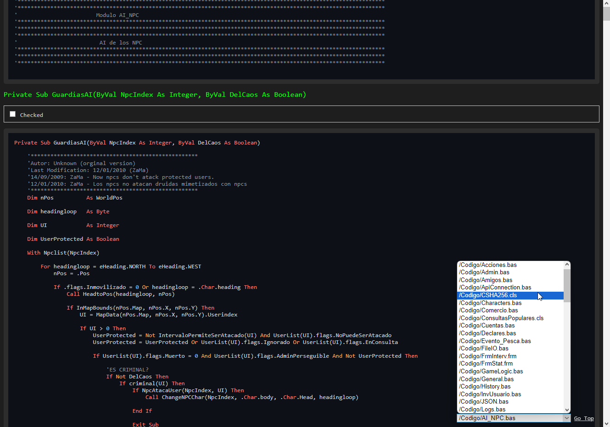

# Zoomer Project: Offline Code Review

Zoomer Project is an application that allows you to **view and navigate** the contents of a code project in a single browser window, **without the need for an internet connection**. It is ideal for **reviewing the progress of migrations** of code between programming languages.

**Features:**

* **Generates a website** with the contents of all files in a folder (and its subfolders)
* **Filter by extensions and syntax type** to show only relevant files
* **Mark methods or functions** as "reviewed"
* **Leave notes** and customizable comments
* **Customizable fields** to adapt the application to your needs
* **Offline functionality** to work anywhere

**Usage:**

```
zoomer --path <project path> [--port <port>]
```

* **`--path`** : Path to the project folder
* **`--port`** (optional): Port where the website is "hosted" (default: 80)

**Example:**

```
zoomer --path ./my-project --port 8080
```

**Benefits:**

* **Quick and efficient code review**
* **Progress tracking** of the migration
* **Comments and notes** to facilitate collaboration
* **Offline access** for greater flexibility

**Zoomer Project** is a powerful tool for developers looking to optimize their workflow and improve collaboration.

## Screenshot

